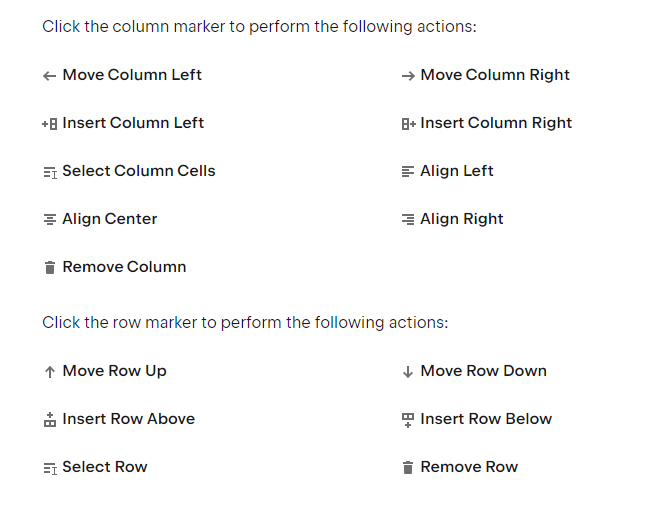

# 
 Welcome to my project

A flutter project that I will test new features and interesting packages

## What should I include next to my LiveScore App

# Below requirements are not included in this project

- [ ] Check the RapidApi if is possible to get data
- [x] **Create new screen MatchFixture to display in a Row the fixtureTile match and below the PageView Widget**

# 
Useful Tutorials

- ## **[RapidApi](https://rapidapi.com/api-sports/api/api-football/pricing)**
- ## **[Swipe Between Themes](https://www.flutterant.com/switching-themes-in-flutter-apps/)**
- ## **[Logo Creator](https://logomakr.com/app/)**
- ## **[Icons for Events](https://www.flaticon.com/)**
- ## **[AdMob Youtube Video](https://www.youtube.com/watch?v=4oLBxuBjGfI)**
- ## **[Social Preview](https://socialify.git.ci/)**
- ### **[Markdown Guide Link](https://www.markdownguide.org/extended-syntax/)**

| **Cyprus League**    | **Live**           | **Events**         | **Lineups**        | **Statistics**     | **Players** | **Predictions**    | **Odds**           | **Statistics**     | **Top Scorers**    | **Standings**      |
|----------------------|--------------------|--------------------|--------------------|--------------------|-------------|--------------------|--------------------|--------------------|--------------------|--------------------|
| Division 1           | :white_check_mark: | :white_check_mark: | :white_check_mark: | :white_check_mark: | :x:         | :white_check_mark: | :x:                | :white_check_mark: | :white_check_mark: | :white_check_mark: |
| Division 2           | :white_check_mark: | :white_check_mark: | :white_check_mark: | :white_check_mark: | :x:         | :white_check_mark: | :x:                | :white_check_mark: | :white_check_mark: | :white_check_mark: |
| Division 3           | :x:                | :x:                | :x:                | :x:                | :x:         | :white_check_mark: | :x:                | :white_check_mark: | :white_check_mark: | :white_check_mark: |
| Cup                  | :white_check_mark: | :white_check_mark: | :white_check_mark: | :x:                | :x:         | :white_check_mark: | :white_check_mark: | :x:                | :x:                | :x:                |
| Super Cup            | :white_check_mark: | :white_check_mark: | :white_check_mark: | :x:                | :x:         | :white_check_mark: | :x:                | :x:                | :x:                | :x:                |
| Cyprus National Team | :white_check_mark: | :white_check_mark: |                    |                    | :x:         | :white_check_mark: |                    |                    |                    |                    |

<h3 align="left">Languages and Tools:</h3>

 

