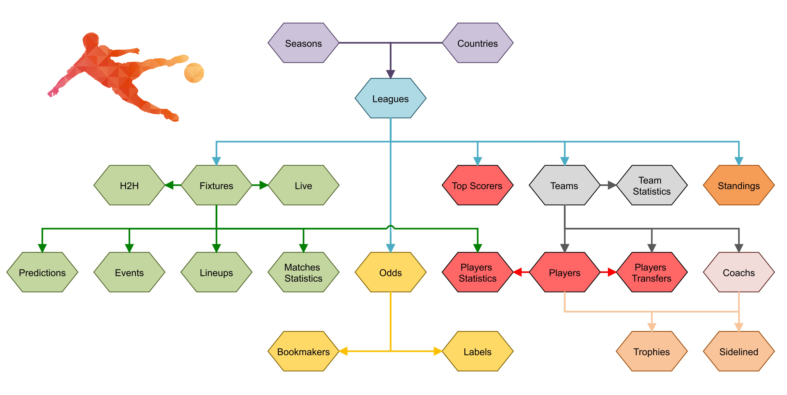

# 
 Welcome to my project

A flutter project that I will test new features and interesting packages

## What should I include next to my LiveScore App
- [ ] Check the RapidApi if is possible to get data
  - 'x-rapidapi-host': "api-football-v1.p.rapidapi.com"
  - final String baseUrl = 'https://api-football-v1.p.rapidapi.com/v3/'
- [ ] Mark favourite team
- [ ] Fixtures screen display league info static with saved png logo and text
- [x] Get live Matches for all the coverage leagues in one screen. The apiLink will be "fixtures?live=318-319-320-321-852";
- [ ] Request from the API my account and subscription details and implement them on a screen
- **To check the Dart SDK directory File -> Settings -> Languages & Frameworks -> Dart**

<strong>API Data Provider</strong>

# 
Useful Tutorials

- ## **[RapidApi](https://rapidapi.com/api-sports/api/api-football/pricing)**
- ## **[Generate UML diagram](https://www.youtube.com/watch?v=PuA9XtazJUA)**
- ## **[Logo Creator](https://logomakr.com/app/)**
- ## **[Icons for Events](https://www.flaticon.com/)**
- ## **[AdMob Youtube Video](https://www.youtube.com/watch?v=4oLBxuBjGfI)**
- ## **[Social Preview](https://socialify.git.ci/)**
- ## **[Markdown Guide Link](https://www.markdownguide.org/extended-syntax/)**

| **Cyprus League**    | **Live Matches**   | **Match Events**   | **Lineups**        | **Match Statistics** | **Players** | **Predictions**    | **Odds**           | **Player Statistics** | **Top Scorers**    | **Standings**      |
|----------------------|--------------------|--------------------|--------------------|----------------------|-------------|--------------------|--------------------|-----------------------|--------------------|--------------------|
| Division 1           | :white_check_mark: | :white_check_mark: | :white_check_mark: | :white_check_mark:   | :x:         | :white_check_mark: | :x:                | :white_check_mark:    | :white_check_mark: | :white_check_mark: |
| Division 2           | :white_check_mark: | :white_check_mark: | :white_check_mark: | :white_check_mark:   | :x:         | :white_check_mark: | :x:                | :white_check_mark:    | :white_check_mark: | :white_check_mark: |
| Division 3           | :x:                | :x:                | :x:                | :x:                  | :x:         | :white_check_mark: | :x:                | :white_check_mark:    | :white_check_mark: | :white_check_mark: |
| Cup                  | :white_check_mark: | :white_check_mark: | :white_check_mark: | :x:                  | :x:         | :white_check_mark: | :white_check_mark: | :x:                   | :x:                | :x:                |
| Super Cup            | :white_check_mark: | :white_check_mark: | :white_check_mark: | :x:                  | :x:         | :white_check_mark: | :x:                | :x:                   | :x:                | :x:                |
| Cyprus National Team | :white_check_mark: | :white_check_mark: |                    |                      | :x:         | :white_check_mark: |                    |                       |                    |                    |

<h3 align="left">Languages and Tools:</h3>

 

